## 🧠 About Me

### 👋 Hi, I’m Robert Bledsaw III  
- **Mechanical Engineer → Software Engineer**: 5 years in the Defense Industry, 3 in Custom Kitchen Equipment, 10+ in Agriculture
- **Backend & DevOps Enthusiast**: Go • PostgreSQL • MS SQL Server • Docker • Kubernetes • Azure DevOps
- **Polyglot Developer**: C/C++, Java, JavaScript, Go, Python, Jython, TypeScript, PHP & more  
- **Automation Aficionado**: ⚙️ from factory-floor to CI/CD pipelines; everything is a workflow 🌎👨‍🚀🔫👨‍🚀
- **Manufacturing Digital Transformation Expert**: ♻️ performing scalable paperless migrations before it was cool 😎
- **Husband & Dad of 12**  

🚀 Always optimizing scripts, systems, and life itself. Let’s build something awesome!

---

## <b> Github Stats </b>
 

| GitHub Stats |
|:------------:|
|  |
|  |
|  |

    

